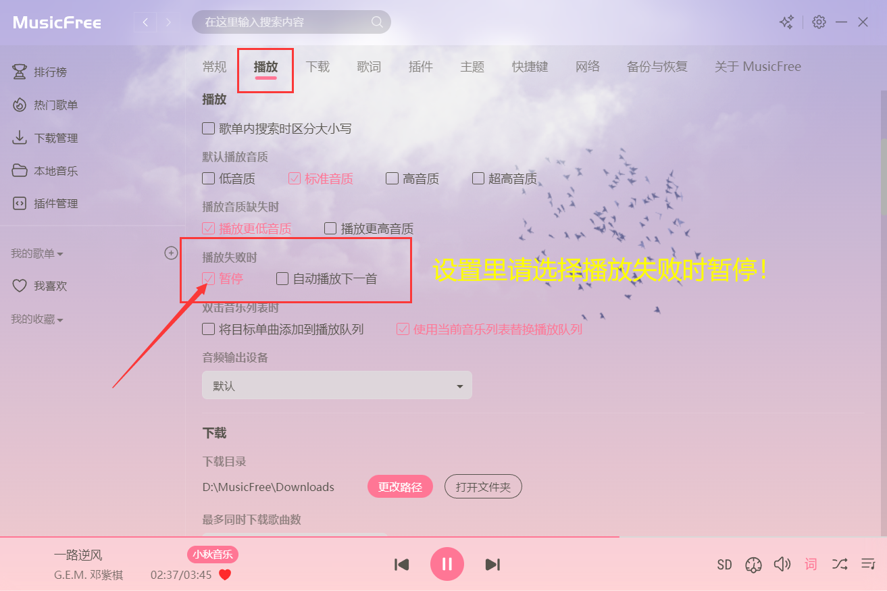
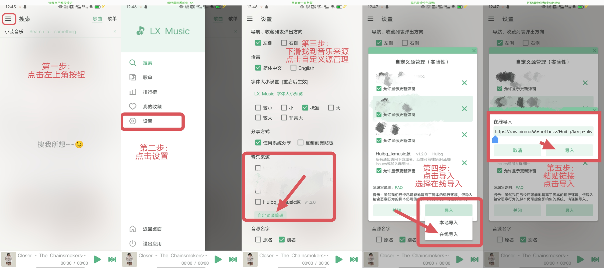
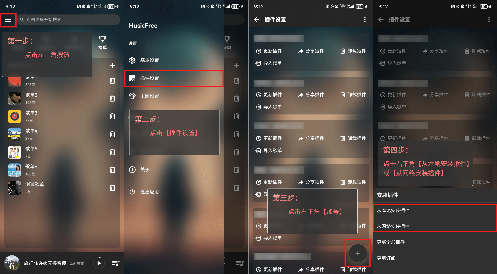

# <p align="center">注意事项&使用教程</p>


## 一. 注意

### 1.1 关于音源

> 音质最高支持320k。
>
> 不支持数字专辑，反复请求可能会导致`封禁IP`！
>
> 仅供在线试听，禁止批量下载，批量下载会被`封禁IP`，请规范使用！
> 
> 尽量避免频繁切换歌曲，否则将导致`封禁IP`

### 1.2 关于使用

- `MusicFree`请在设置里选择：`播放失败时暂停`！

> 否则在某些情况下会被封禁IP



### 1.3 关于解封

> 点击这里获取IP: [IP地址查询](https://ip125.com)
>
> 将IP发送到这个邮箱：wcisman8@outlook.com

## 二. 洛雪音乐

> 软件请转跳下载: [安卓 -> 洛雪音乐](https://github.com/lyswhut/lx-music-mobile/releases)
>
> 软件请转跳下载: [Windows&MacOS -> 洛雪音乐](https://github.com/lyswhut/lx-music-desktop/releases)

- 洛雪音乐音源链接：
```any
https://raw.niuma666bet.buzz/Huibq/keep-alive/master/render_api.js
```

- 教程请看png!



## 三. MusicFree

> 软件请转跳下载: [安卓-> MusicFree](https://github.com/maotoumao/MusicFree/releases)
>
> 软件请转跳下载: [Windows&MacOS -> MusicFree](https://github.com/maotoumao/MusicFreeDesktop/releases)

- MusicFree音源链接：
```any
https://raw.niuma666bet.buzz/Huibq/keep-alive/master/Music_Free/myPlugins.json
```

- 教程请看png!



## Star History
[](https://starchart.cc/Huibq/keep-alive)
